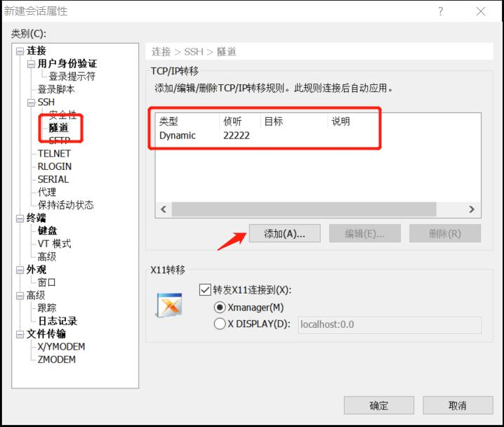
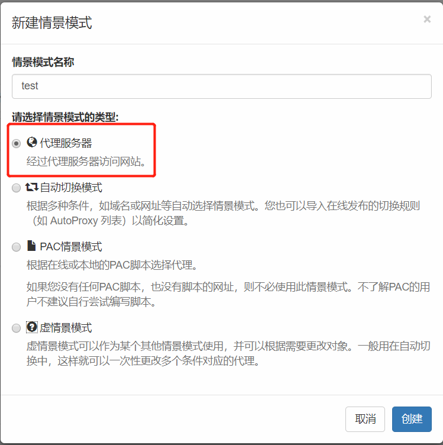
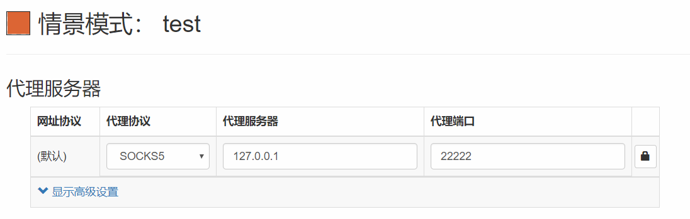
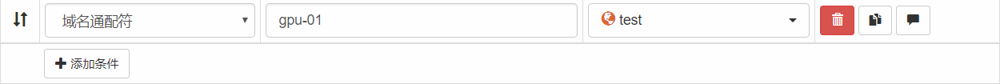

# 使用 ssh 创建 socks 代理

## 使用 ssh 进行动态端口转发

假设本地端口为 22222，远程主机为 test.com，远程端口为 1234，用户名为 mark。可以使用命令行或 XShell。

命令行：

```
ssh -D 22222 -p 1234 -l mark test.com
```

XShell：



## 在浏览器中设置代理

在 Chrome 中可以使用 [SwitchyOmega](https://chrome.google.com/webstore/detail/proxy-switchyomega/padekgcemlokbadohgkifijomclgjgif)。

新建情景模式：



配置情景模式：



在自动切换中添加需要代理的域名 / 主机名 （比如 gpu-01）：



然后就可以通过 ssh 的 socks 代理访问被代理域名任意端口的服务了。
